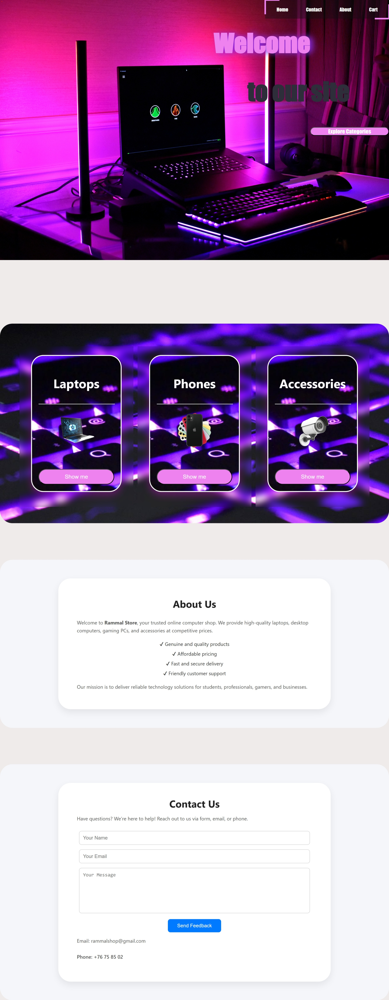
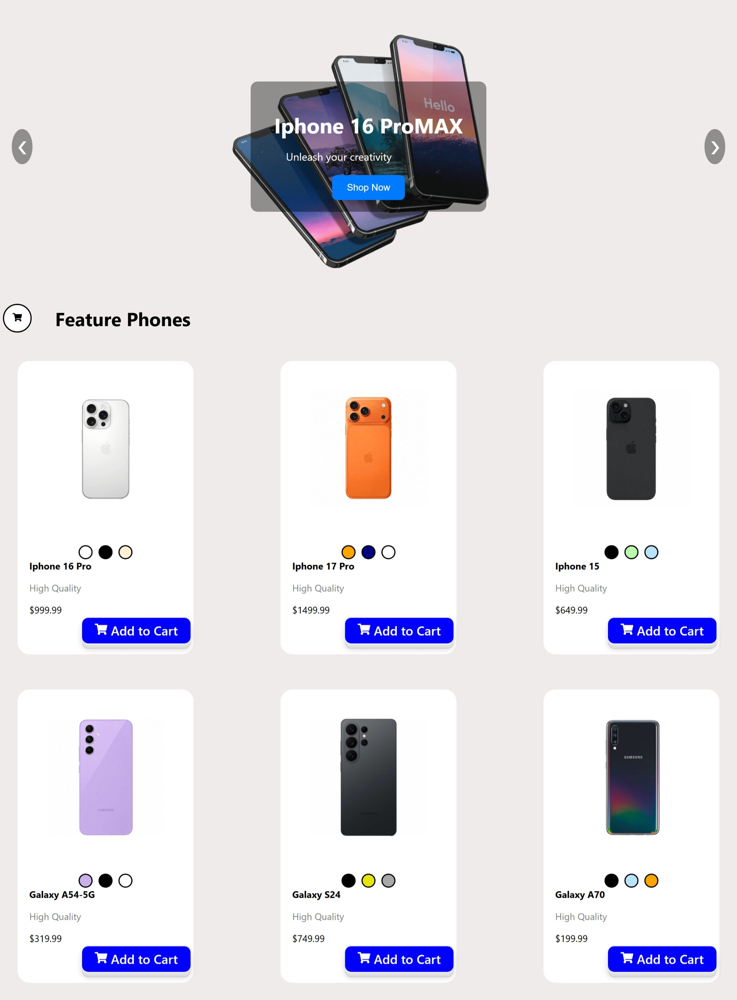
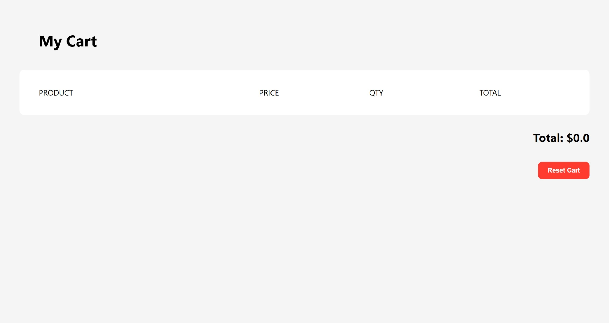
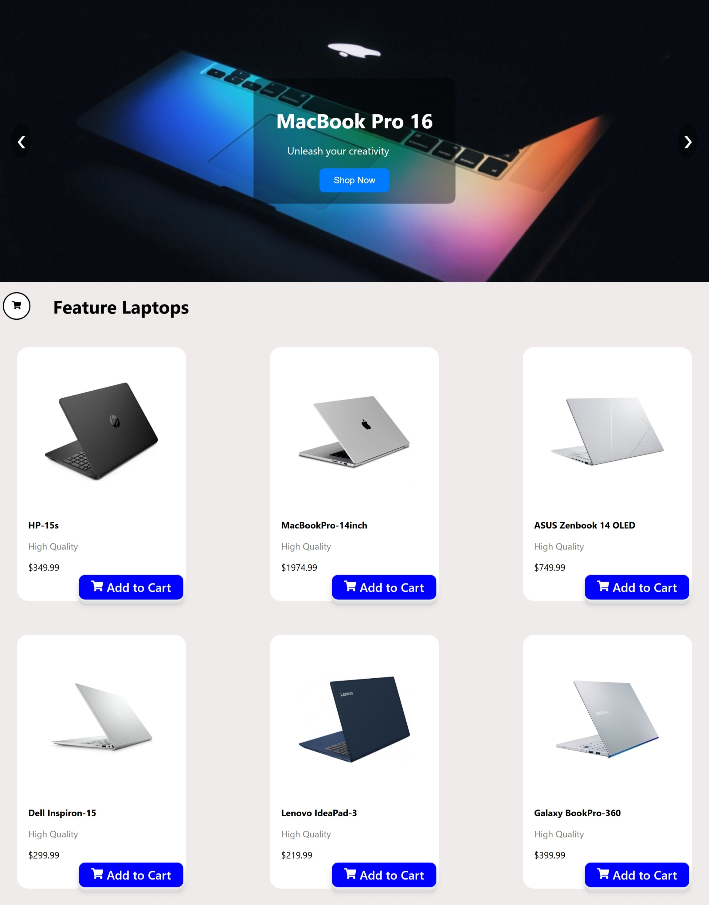
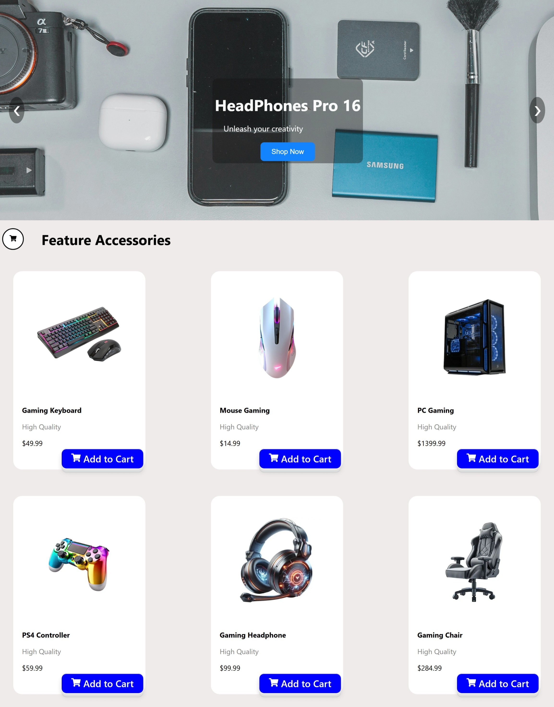
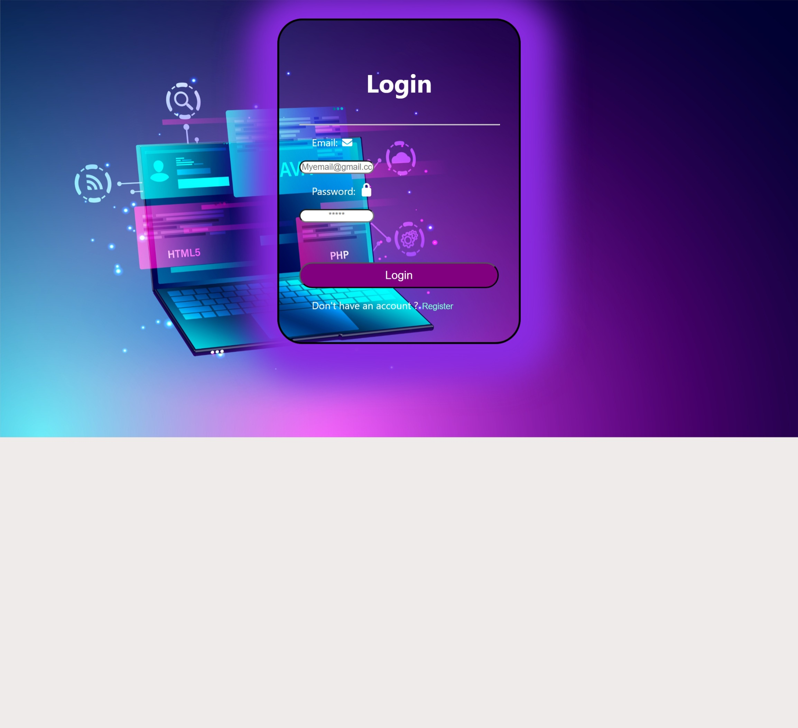

#  React E-Commerce Website

## Project Description
This is a React-based E-Commerce Website developed as part of a web development assignment. The project demonstrates the use of ReactJS for building a modern, responsive, and component-based web application.

The website includes multiple pages such as Home, Phones, Laptops, Accessories, Cart, and Login. Navigation is handled using React Router for a smooth single-page application experience. The project focuses on UI design, routing, and responsive layout for both desktop and mobile devices.

---

##  Live Demo
https://willowy-kelpie-86afe1.netlify.app

---

##  Technologies Used
- ReactJS
- React Router DOM
- CSS3
- React Icons
- Framer Motion
- Netlify (Deployment)

---

##  Features
- Multi-page website (Home, Phones, Laptops, Accessories, Cart, Login)
- Responsive design for mobile and desktop
- Product display sections
- Shopping cart UI
- Smooth navigation using React Router
- Modern UI design

---

##  Setup Instructions

To run this project locally:

```bash
npm install
npm start

## 📸 Screenshots

### Home Page


### Phones Page


### Cart Page


### Laptops Page


### Accessories Page


### Login Page
